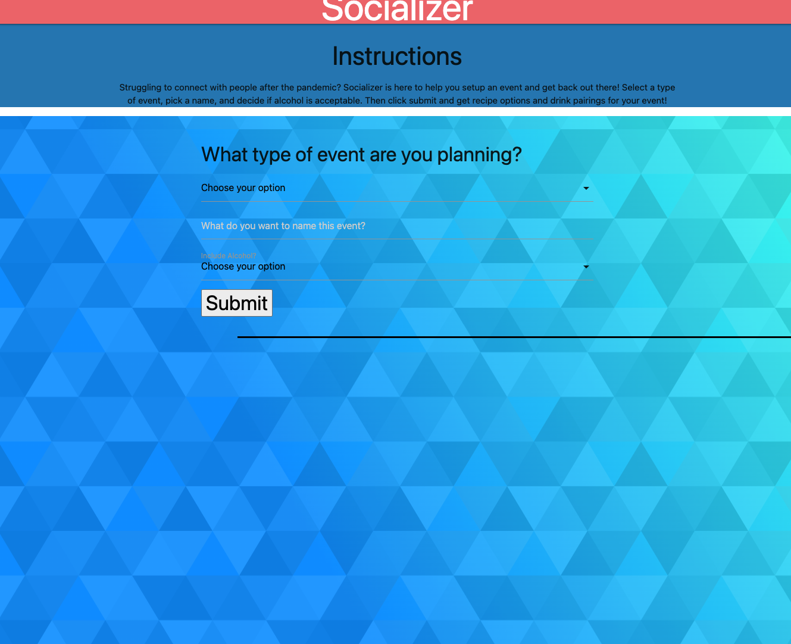

# Socializer

## Description

* For this project we used HTML, CSS, Java Script, and JQuery to create an event planner app. The event planner helps you choose recipes and beverages based on the theme of your event. We styled our app with Materialize. By doing this project we were able to showwcase all the skills we have learned in our bootcamp so far. It was a good project to practice working as a team to code, merge, and deploy a final product! 

## Usage

* Use event planner to help you choose recipes and beverages to host a party. 

## Links to deployed content
https://anoorishad.github.io/Socializer/

## Screenshots

